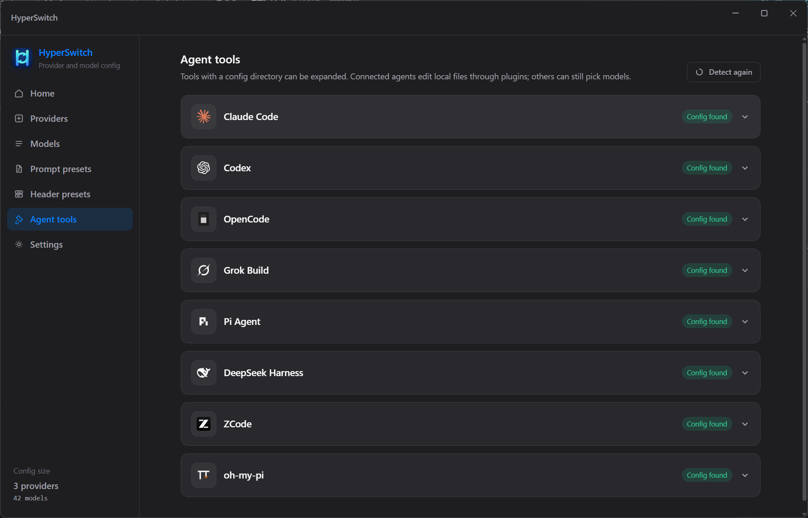
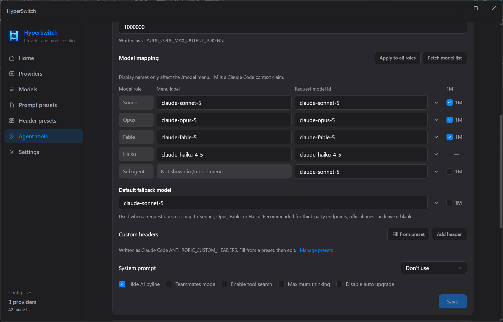
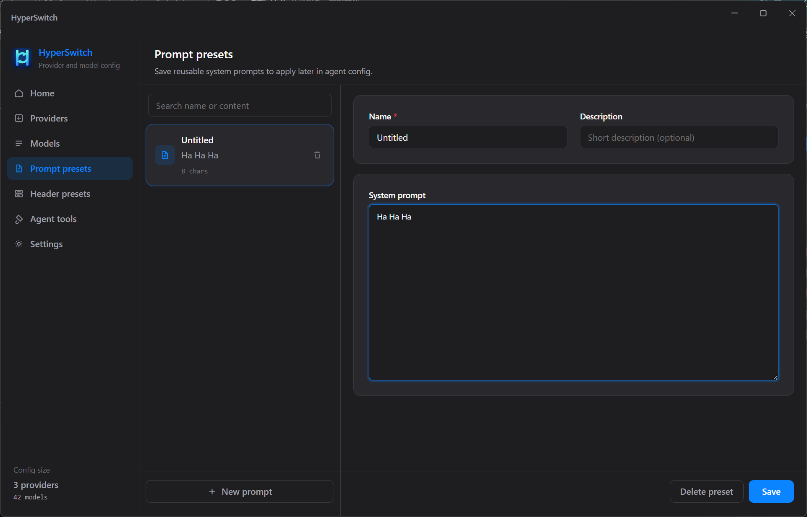
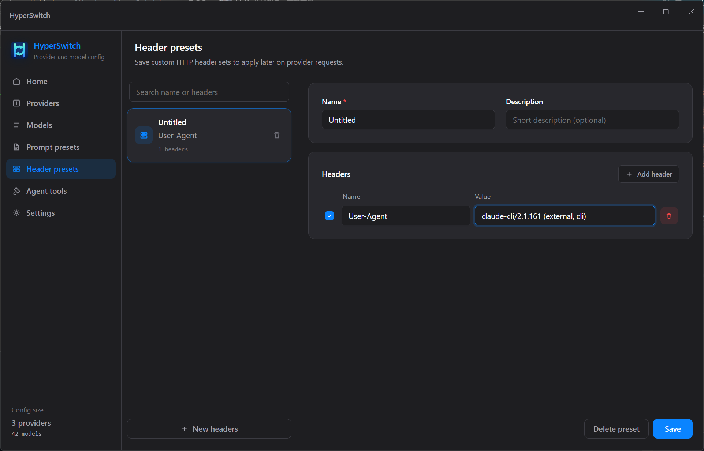

<p align="center">
  
</p>

<h1 align="center">HyperSwitch</h1>

<p align="center">把供应商、模型和提示词写入各 Agent 的本地配置。</p>

<p align="center">
  <a href="./README.md">English</a> · <b>简体中文</b>
</p>

---

桌面端配置管理器。在一个地方维护 API 供应商与模型，再按各工具自己的格式写到本地配置目录，避免在 Claude Code、Codex、OpenCode、Grok 等软件里逐个改。

## 功能

- **供应商**：自定义 Base URL、API Key、接口格式与模型；可从 OpenAI 兼容 `/models` 拉取 ID
- **模型目录**：从 [models.dev](https://models.dev) 更新上下文窗口、输出上限、思考强度与模态，添加模型时作预填充
- **提示词 / 请求头预设**：做成可复用条目，在 Agent 页套用
- **Agent 工具**：检测本机配置目录，直接编辑并写回
- **首次引导**：无 `~/.hyperswitch/onboarded` 时引导更新 models.dev 并说明用法（可跳过更新）
- **语言**：默认英文，可在设置中切换（8 种语言）

供应商主键是 **slug**（小写字母开头，仅含小写字母、数字和连字符）。写入各 Agent 时用 slug 识别供应商，不用名称或 Base URL。

拉取 `/models` 只帮助填写模型 ID，不会自动推断能力。能力来自 models.dev 预填充或手动填写。

## 支持的 Agent

| 工具 | 配置目录 |
| --- | --- |
| Claude Code | `~/.claude` |
| Codex | `~/.codex` |
| OpenCode | `~/.opencode`、`~/.config/opencode` |
| Grok Build | `~/.grok` |
| Pi Agent | `~/.pi` |
| DeepSeek Harness | `~/.dsh` |
| ZCode | `~/.zcode` |
| oh-my-pi | `~/.omp` |

接口格式支持 OpenAI Chat Completions、OpenAI Responses、Anthropic Messages、Google Generative AI。各工具按自身能力接入，不支持的选项不会强行写入。

<p align="center">
  
</p>

<p align="center"><sub>Agent 工具列出全部支持的软件。<b>Config found</b> 表示本机配置目录存在，可通过插件写入。新装工具后点 <b>Detect again</b>。</sub></p>

## 使用流程

1. **供应商**：填写接口和模型
2. **提示词预设 / 请求头预设**（可选）：保存可复用内容
3. **Agent 工具**：选择供应商与模型，写入对应软件

之后可在「设置」或主页再次更新 models.dev。

## 界面预览

### 在 Agent 上映射模型

每个 Agent 有自己的角色（图为 Claude Code：Sonnet / Opus / Fable / Haiku / Subagent）。菜单名称只影响工具里 `/model` 的显示，真正发出去的是请求模型 id。**1M** 是 Claude Code 的上下文窗口声明，不是从 `/models` 推断出来的。

<p align="center">
  
</p>

<p align="center"><sub>可从模型目录预填充，也可手填 id。自定义请求头和系统提示词可选；目标工具不支持的选项不会写入。</sub></p>

### 提示词预设

在这里保存可复用的系统提示词，再到 Agent 页选择是否套用。预设只做预填充，不会锁死字段。

<p align="center">
  
</p>

### 请求头预设

保存可复用的 HTTP 请求头（例如 `User-Agent`）。在 Agent 页用 **Fill from preset** 填入后仍可再改再保存。

<p align="center">
  
</p>

## 数据目录

配置保存在用户主目录下的 `.hyperswitch/`：

| 文件 | 内容 |
| --- | --- |
| `providers.json` | 供应商与模型 |
| `agent-bindings.json` | Agent 绑定 |
| `prompt-presets.json` | 提示词预设 |
| `header-presets.json` | 请求头预设 |
| `models-dev.json` | models.dev 目录缓存 |
| `prefs.json` | 应用偏好（语言） |
| `onboarded` | 首次引导完成标记 |

设置页可打开该目录。API Key 明文写在本地配置里，请自行保管数据目录。

旧版单一 `config.json` 会在启动时拆成上述文件。

## 开发

需要 Node.js 20.19+。

```bash
npm install
npm run dev
```

| 命令 | 说明 |
| --- | --- |
| `npm run dev` | 启动 Electron + Vue 热更新 |
| `npm run typecheck` | 主进程 / 渲染进程类型检查 |
| `npm run build` | 生产构建（不含安装包） |
| `npm run build:win` | Windows NSIS 安装包 |
| `npm run build:mac` | macOS DMG / ZIP（必须在 macOS 上打） |
| `npm run build:linux` | Linux AppImage / deb |

安装包输出在 `dist/`。请在对应系统上打包：Windows 用 `build:win`，macOS 用 `build:mac`，Linux 用 `build:linux`。Windows 上打不出 macOS 安装包。

推送以 `Release` 开头的 tag（例如 `Release-0.1.0`）会触发 GitHub Actions，构建 Windows / macOS / Linux 安装包（x64 与 arm64）并发布 GitHub Release。macOS 包不签名。

```bash
git tag Release-0.1.0
git push origin Release-0.1.0
```

工作流文件必须在被打 tag 的那次提交上。对同一 tag 重跑会覆盖该 Release。

主进程 IPC 变更后需要重启 Electron，仅渲染层热更新不够。

## 目录

```
src/
  main/        Electron 主进程（落盘、catalog、Agent 插件）
  preload/     预加载与 IPC 桥
  renderer/    Vue 3 界面
  shared/      供应商、预设、Agent 类型
```

新增 Agent 时：在 `src/shared/agentPlugin.ts` 登记，实现 `src/main/agentPlugins/<id>.ts`，并在渲染进程注册对应编辑器。
